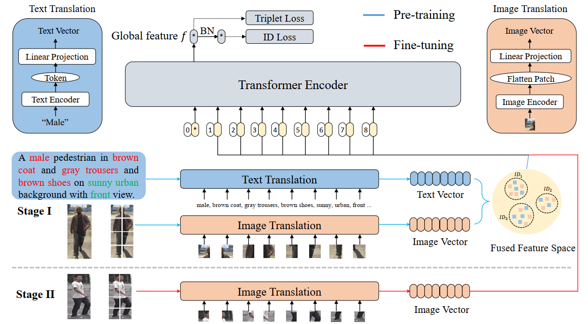

[](https://opensource.org/licenses/MIT)


# DMF

## Deep Multimodal Fusion for Generalizable Person Reidentification



This is the official implementation of our paper [Deep Multimodal Fusion for Generalizable Person Re-identification](). And the pretrained models can be downloaded from [data2vec](https://github.com/facebookresearch/data2vec_vision/tree/main/beit).

### News
- Support Market1501, CUHK03, MSMT17 and RandPerson datasets.


### TODO
Write the documents

### Requirements
- torch
- torchvision
- timm
- yacs
- opencv-python
- fairseq

### How to use it?
This repo. supports training on multiple GPUs and the default setting is single GPU (One RTX 3090 GPU).

1. Download all necessry datasets (e.g. Market1501, CUHK03 and MSMT17 datasets) and move them to 'data'.   
2. Training
```
python train.py
```
3. Testing
```
python test.py
```

### Experiment Results on Market-1501, CUHK03 and MSMT17 datasets.
<!-- markdownlint-disable MD033 -->
<table>
    <tr>
        <th rowspan="2">Dataset for fine-tuning</th>
        <th colspan="2">Market-1501</th>
        <th colspan="2">CUHK03</th>
		<th colspan="2">MSMT17</th>
        <th rowspan="2">Settings</th>
    </tr>
    <tr>
        <td>Rank-1</td>
        <td>mAP</td>
		<td>Rank-1</td>
        <td>mAP</td>
        <td>Rank-1</td>
        <td>mAP</td>
    </tr>
    <tr><td>Market-1501</td><td>--</td><td>--</td><td>23.4</td><td>22.6</td><td>50.6</td><td>21.5</td><td>1GPUs</td></tr>
    <tr><td>MSMT17</td><td>81.3</td><td>55.1</td><td>26.1</td><td>24.7</td><td>--</td><td>--</td><td>1GPUs</td></tr>
    <tr><td>MSMT17~all~</td><td>82.6</td><td>58.8</td><td>34.0</td><td>32.1</td><td>--</td><td>--</td><td>1GPUs</td></tr>
    <tr><td>RandPerson</td><td>78.7</td><td>52.0</td><td>21.5</td><td>19.3</td><td>52.4</td><td>18.9</td><td>1GPUs</td></tr>
</table>

### Acknowledgments
This work was supported by the National Natural Science Foundation of China under Projects (Grant No. 61977045 and Grant No. 81974276).
If you have further questions and suggestions, please feel free to contact us (xiangsuncheng17@sjtu.edu.cn).